# Can you predict if a post/meme/idea will go viral on Tumblr?

### Abstract

Tumblr.com is a microblogging website known for its notoriously unique user base and weird content. Most NLP research done about Tumblr up to this point has been about either extremist groups, or looking at things other than the specific text of messages. Using a few different methods, this study will attempt to simply look at a wide variety of different posts to try to guess if that post went viral.

### 1. Introduction

Tumblr.com is a microblogging website where users can share many posts to their blogs. They can like, reply, or reblog (sharing the post to their blog with potentially different tags and added content) these posts, and the number of times a post is liked, replied to, or reblogged, is tracked in a metric called 'Notes.' In this study, notes are going to be the metric by which we see if a post has gone viral. On these posts users may put tags on which are meant to help note what a post is about, or help it be found in a search (so an apple pie recipe might be tagged with "#apple pie" "#food" "#recipe" "#pie recipe" etc.). This study will look at posts within certain tags and try different methods to see if it's possible to predict how many 'notes' that post will get. 

### 2. Related Work

#### 2.1 Broad Analysis of Social Media Communites

With the rise of social media, NLP researchers have seen the massive corpora available, and used them as a point of study in various ways. Each of these studies provides a useful look into the ways other researchers have tackled the substantial goal of trying to analyze social media data using NLP.

[Kanakaraj and Guddeti (2015)](#kanakaraj2015) uses Sentiment Analysis to try to understand the overall mood of Twitter when looking at a specific social issue, and [Balahur (2013)](#balahur2013) also looks at Sentiment analysis on twitter, though it gives an overview of a new process they are proposing for doing this sort of sentiment analysis. [Hutto and Gilbert (2014)](#hutto2014) also propose a new way of performing Sentiment analysis on tweets, which they call VADER, and which boasts an accuracy that outperforms human raters.

[Neunerdt et al. (2013)](#neunerdt2013) propose a method of Part of Speech (POS) tagging for looking at posts from the German site Heise.de. [Meftah and Semmar (2018)](#meftah2018) take a neural network approach to POS tagging of posts on Web forums, Twitter, and Facebook.[Behzad and Zeldes (2020)](#behzad2020) lays out an approach to POS tagging on Reddit to try to find a better method for POS tagging, because many current models are less accurate when looking at posts from the Internet.

[Yoder (2021)](#yoder2021) looks at identity through Tumblr and Archive of Our Own, and takes a variety of different approaches to try to track and understand the identities of posters through a very broad means.

Each of these studies provide a foundation for looking at online text-based content that this project will seek to build on.

#### 2.2 Virality of Content

On top of looking broadly at social media data, there have been many studies that look at how content spreads through platforms and communities.

As a part of their study, [Jamali and Rangwala (2009)](#jamali2009) looked at different methods for specifically measuring how popular a post will become, specifically for the news aggregation website digg.com. When looking at post popularity, they looked at a ’Digg score’, which is a metric of how much the article was seen, in comparison with how many times it was ignored. To contrast that, this project will be using Tumblr’s ’notes’ metric, which is a measure of total engagement (likes, comments, reblogs) with the post.

[Guerini and Strapparava (2016)](#guerini2016), on the other hand, looked at urban legends instead of internet sources, and tried to see what would make certain urban legends spread. They used a lot of different metrics to try to predict what would make an urban legend spread, from POS tagging, sentiment analysis, to readability. Similarly to that, this project will try to use as many different measures as possible to see what is the best predictor of virality, but this will be looking at the much more chaotic and random realm of the text posts on Tumblr.

[Yoder et al. (2020)](#yoder2020) mainly looks at the topic of idea spread through the lens of self-presentation and identity. This paper reaches the conclusion that users having similarites in the identities they choose to present on their blogs help posts spread between them. This method of person to person communication is how these individual posts spread, but this paper is more curious about if the content of the posts themselves helps with the propogation.

### 3. Methods

To gather the corpuses I used the Tumblr API, which has some serious limitations that fundamentally change how what is being looked at. The API only allows posts to be acquired by grabbing by tag, user, or blog. Since grabbing by user will only get posts made by a single person, and by blog will only add to that posts that that single person liked, there is too much bias there to be able to analyze if you can track how well a post can go viral, as opposed to how well a *certain person's* post will go viral. So the only option left for gathsering the corpus here is gathering by tag, which will add its own layer of bias, but the question of whether a post will go viral given it has a particular tag, is one that will have significantly less bias, and will be useful, especially if care is taken to which tags are taken from, which will be discussed further in section 4.

The Tumblr API returns a JSON object, which converted to a list of dictionaries in Python, which was the language used for this, which was removed of attributes that were unneccesary for this project. After that point the lists were split and a random 90% were selected as training data, and the other 10% was selected as test data. 

For testing the data, a few controls were used, to test the accuracy of certain metrics against. To control for how recent posts can have less time to be seen, the timestamp Tumblr places on every post was used as a metric. Since tumblr places weight on the number of tags a post has, that, too, was used as a control, to see if the number of tags had a major effect how viral a post goes. The Fog Index, as laid out in [Guerini and Strapparava (2016)](#guerini2016), was used to see if readability played a factor in the virality of a post. For looking at the n-grams (specifically looking at unigrams, bigrams, and trigrams), a Naive-Bayes algorithm was used (specifically [nltk's Naive-Bayes Classifier](https://www.nltk.org/api/nltk.classify.naivebayes.html)) to try to see if the use of certain n-grams had an effect on virality. For both speed and space efficiency, only the most popular 5 n-grams from any given post were used when calculating, as varying showed little to no change.

For the timestamp, number of tags, and readability tests, [Numpy's polyfit function](https://numpy.org/doc/stable/reference/generated/numpy.polyfit.html) was used to generate a linear trendline,and that is what the accuracy reports are based off of. 

All the code and data for this project can be found at https://github.com/dylneed/ViralTumblrNLP.

### 4. Tags

#### 4.1 Discourse

The discourse tag on Tumblr is fairly self explanatory, and is a very useful tag in this context. Since it's almost entirely used while accompanying large rants, it proved to contain a very large set of text only posts. As these are posts that the user knowingly tagged discourse, there is a bias here towards controversial subjects, or at least, subjects that the poster finds controversial. For this tag, a set of 35,678 text only posts was used.

#### 4.2 Assorted 'Meme Phrases'

What I will be referring to from now on as 'Meme Phrases' or 'Tumblr Meme Phrases' is a collection of phrases that are very similar in that they are nigh incomprehensible to someone who is not terminally online. The terms (who's meaning doesn't matter nearly as much as their general use) are "Blorbo", "Blorbo from my shows", "Glup Shitto", "Eeby Deeby", "Horse Plinko", and "It's me boy, I'm the PS5". Combining these tags led to a set of 7,986 text only posts.

#### 4.3 Dracula Daily

[Dracula Daily](https://draculadaily.substack.com/about) is an email service that will email anyone who signs up parts of the novel *Dracula* by Bram Stoker on the days that the diary entries/letters took place in the novel. Tumblr found this very quickly and, while it is very recent, the service took off, and so there has been a lot of buzz about this recently. For this tag, a set of 4,529 text only posts was used.

#### 4.4 Our Flag Means Death

Our Flag Means Death is an HBO Max comedy about pirates which has recieved praise for it's broad inclusions and handling of LGBTQ+ characters. Due to this, and the presence of multiple explicitly queer relationships, the show has quite popular on Tumblr. Since the show is recent, all the posts are very recent as well. The set gathered is made up of 3,188 text only posts, and is a combination of the 'our flag means death' and 'ofmd' tag, as that abbreviation is often used to tag posts about the show.

### 5. Results

#### 5.1 Post ages

Tumblr stores their timestamps as integer values, and that was used as the axis on which to build the trendline. As is fairly clear from the graphs, there is pretty much no correlation between notes and the posts age. One thing that is interesting is, in the discourse tag, that their is a large gap where no posts existed. It is likely that this gap is due to some sort of move where the timestamp was moved up a degree due to some internal move (potentially due the buyout or eventual reselling of Tumblr.com by Yahoo!).

|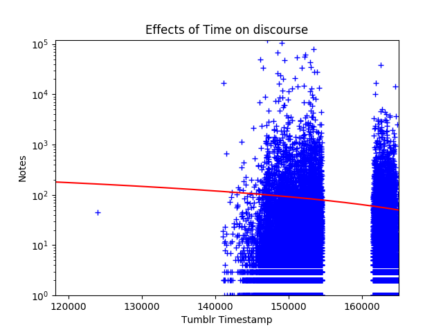|
|:---|
|Effects of Timestamp on the Discourse tag|

|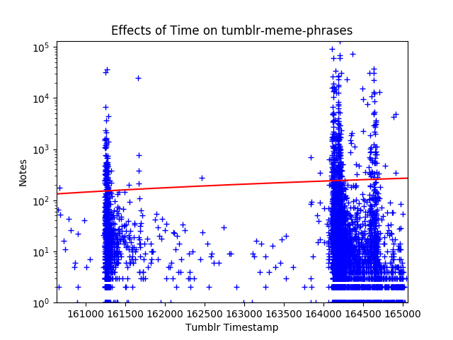|
|:---|
|Effects of Timestamp on the 'Meme Phrases' tags|

|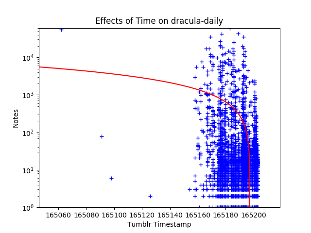|
|:---|
|Effects of Timestamp on the Dracula Daily tag|

|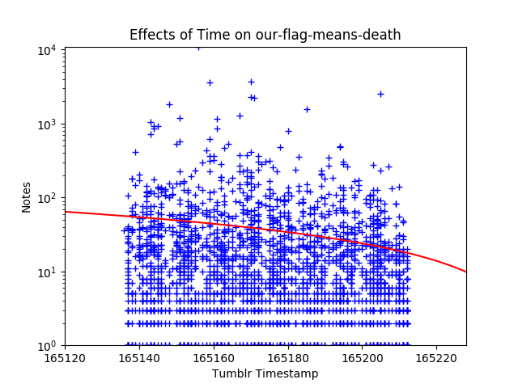|
|:---|
|Effects of Timestamp on the Our Flag Means Death tag|

Overall, it is very clear that the age of a post is not a good predictor of how likely that post is to go viral.

**Accuracy of Post Timestamp for predicting notes count**
|Tag|Accuracy|
|:---|:---:|
|Discourse|17.06%|
|Meme Phrases|9.17%|
|Dracula Daily|11.84%|
|Our Flag Means Death|26.86%|

#### 5.2 Number of Tags

Another control to look at is the number of tags a post has. Again, it is clear to tell that number of tags is very uncorrelated with how many notes a post gets, though an interesting thing about the graph is how the majority of well-performing posts exist have 10 or less tags. The majority of posts however, also seem to live here, so that seems to be more of a trivial fact than anything else.

|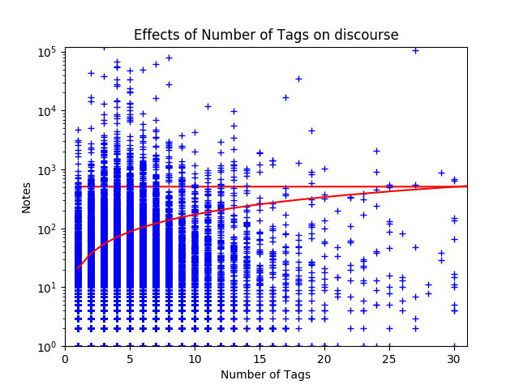|
|:---|
|Effects of number of tags on the Discourse tag|

|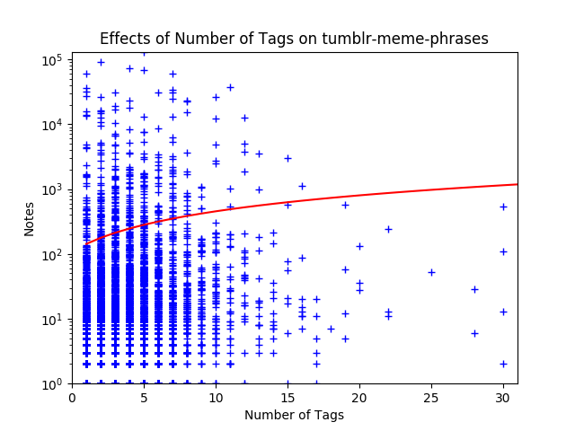|
|:---|
|Effects of number of tags on the 'Meme Phrases' tags|

|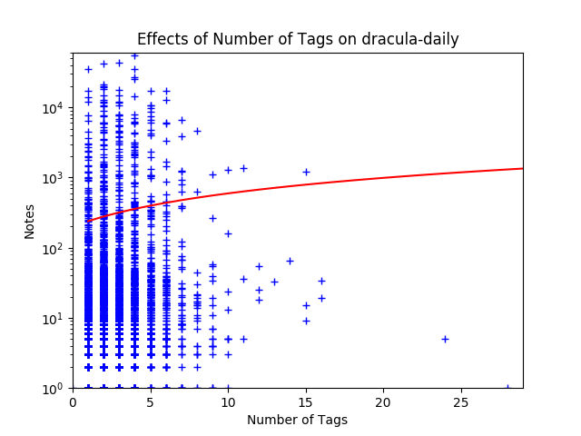|
|:---|
|Effects of number of tags on the Dracula Daily tag|

|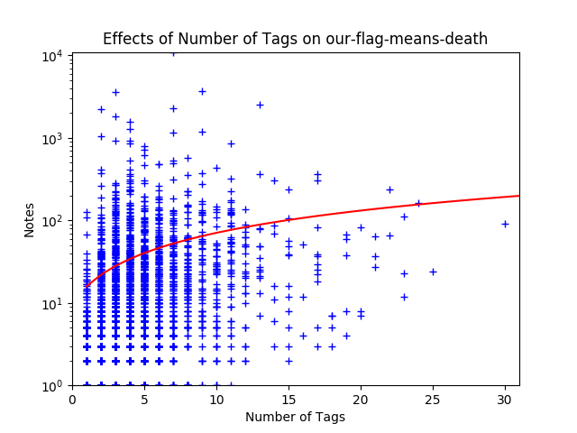|
|:---|
|Effects of number of tags on the Our Flag Means Death tag|

**Accuracy of number of tags for predicting notes count**
|Tag|Accuracy|
|:---|:---:|
|Discourse|17.91%|
|Meme Phrases|8.78%|
|Dracula Daily|8.38%|
|Our Flag Means Death|26.39%|

#### 5.3 Readability (Fog Index)

With the fog index, again the trendline is incredibly uncorrelated to the rest of the graph. A similar thing also happened here as it did with number of tags, and that is that the majority of both posts in general, as well as just well-performing posts, appear in the lower parts of the fog index, specifically here under 25. 

|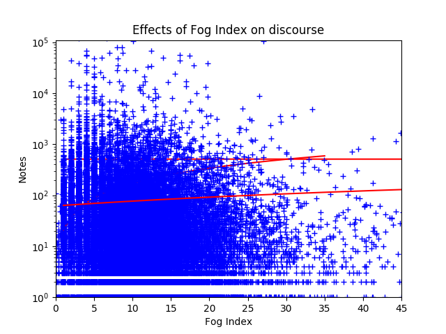|
|:---|
|Effects of Fog Index on the Discourse tag|

|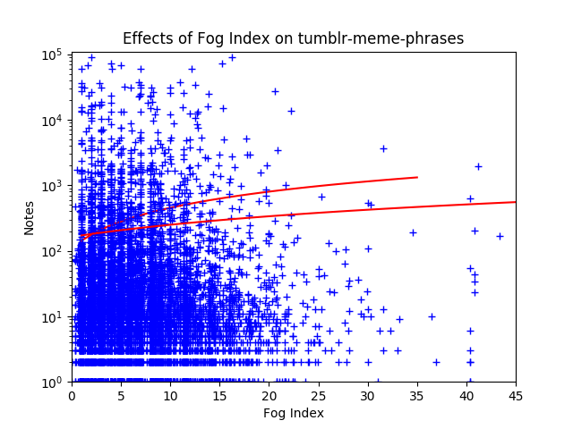|
|:---|
|Effects of Fog Index on the 'Meme Phrases' tags|

|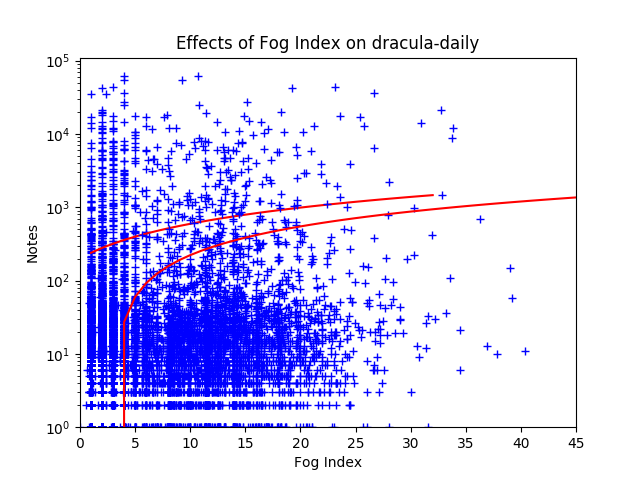|
|:---|
|Effects of Fog Index on the Dracula Daily tag|

|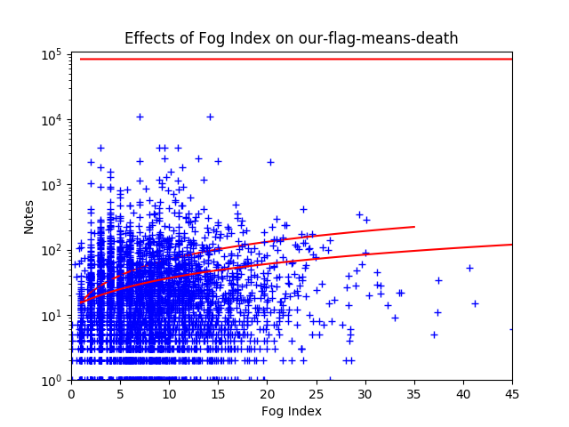|
|:---|
|Effects of Fog Index on the Our Flag Means Death tag|

**Accuracy of Fog Index for predicting notes count**
|Tag|Accuracy|
|:---|:---:|
|Discourse|16.60%|
|Meme Phrases|9.01%|
|Dracula Daily|10.25%|
|Our Flag Means Death|26.61%|

#### 5.4 Naive-Bayes Classifier of n-grams

For looking at the uni-, bi-, and trigrams, there is not visual representation to look at, but we can look at the most informative features. Here these all seem to be punctuation, which makes sense as, punctuation is bound to be the thing that comes up most often. Seeing exclamation points and '2022' for the 'Meme Phrases' data set makes sense, as most of those memes starting really spreading around early 2022, and garnered quite a bit of shock and attention. Looking at the set, it also seems as though the Naive-Bayes algorithm was looking at the n-grams alphabetized, and that is why it is mainly punctuation, numbers and a words featured here. This also means that the algorithm most likely did not find any largely informative features, which would imply that there are no n-grams that can really inform how well a post will do, and that other factors must be at play.

**Most informative n-grams by tag**
|Discourse|'Meme Phrases'|Dracula Daily|Our Flag Means Death|
|:---:|:---:|:---:|:---:|
|!1|!!!|)|*|
|%|..|[|...|
|) (|...|absolutely|about|
|, a|....|again|as|
|1|2022|also|do|

**Accuracy of Naive-Bayes for predicting notes count**
|Tag|Accuracy|
|:---|:---:|
|Discourse|6.32%|
|Meme Phrases|4.01%|
|Dracula Daily|4.76%|
|Our Flag Means Death|15.12%|

### 6. Bias

There is a large amount of bias throughout this paper that needs to be acknowledged.

A large portion of this bias comes from the use of solely text-only posts. Since this project uses only NLP techniques for trying to predict virality, non-text posts had to be ignored for the project, as posts with non-text elements would have confounding factors that would be unseen, as processing images is an entire field unto itself, and while Tumblr has a section of it's user base who will transcribe images, that group is not large enough to allow for a useful analysis to be done, since those can drastically vary in terms of how a user chooses to transcribe the image.

The other large source of bias comes from tag selection. In this paper, a broad set of tags was attempted to be grabbed, but no set of tags will accurately describe an entire site's culture. This limitation also prevented the plethora of non-tagged posts to completely slip through the cracks.

Tumblr does not allow for public access to follower count, and since it's unlikely that a certain user will post enough within the same tag to create a significant group to be looked at together. Due to this, it would be very difficult to measure how follower count affects post virality, though it is almost certain that that has a very large factor.

### 7. Conclusion

Overall, this study came back very negative on the original question of whether one can guess how viral a post on tumblr. None of the methods here seemed to get very accurate results. Readability was at a very similar level of accuracy to the control groups (number of tags and timestamp), and the best performance there was for each of them came from the control groups for all the tags tested. Surprisingly, testing the n-grams with the Naive-Bayes algorithm was the worst performing test. 

Looking at how inaccurate everything was (the best performing metric being only 26% accurate) I think it is fairly safe to conclude that, using the methods used here, it is not possible to predict the virality of a tumblr post based solely on it's text.

### References

<a name="balahur2013">Alexandra Balahur. 2013.</a>
[Sentiment analysis in social media texts](https://aclanthology.org/W13-1617.pdf). 
In *Proceedings of the 4th workshop on computational approaches to subjectivity, sentiment and social media analysis*, pages 120–128.

<a name="behzad2020">Shabnam Behzad and Amir Zeldes. 2020.</a>
[A cross-genre ensemble approach to robust reddit part of speech tagging](https://arxiv.org/abs/2004.14312).
*CoRR*, abs/2004.14312.

<a name="guerini2016">Marco Guerini and Carlo Strapparava. 2016.</a>
[Why do urban legends go viral?](https://doi.org/10.1016/j.ipm.2015.05.003)
*Information Processing & Management*, 52(1):163–172.

<a name="hutto2014">Clayton Hutto and Eric Gilbert. 2014.</a>
[Vader: A parsimonious rule-based model for sentiment analysis of social media text](https://web.archive.org/web/20191203143458id_/http://comp.social.gatech.edu/papers/icwsm14.vader.hutto.pdf).
In Proceedings of the international AAAI conference on web and social media, volume 8, pages 216–225

<a name="jamali2009">Salman Jamali and Huzefa Rangwala. 2009.</a>
[Digging digg: Comment mining, popularity prediction, and social network analysis](https://doi.org/10.1109/WISM.2009.15).
In *2009 International Conference on Web Information Systems and Mining*, pages 32–38. IEEE.

<a name="kanakaraj2015">Monisha Kanakaraj and Ram Mohana Reddy Guddeti. 2015.</a>
[Performance analysis of ensemble methods on twitter sentiment analysis using nlp techniques](https://doi.org/10.1109/ICOSC.2015.7050801).
In *Proceedings of the 2015 IEEE 9th International Conference on Semantic Computing (IEEE ICSC 2015)*, pages 169–170.

<a name="meftah:2018">Sara Meftah and Nasredine Semmar. 2018.</a>
[A neural network model for part-of-speech tagging of social media texts](https://aclanthology.org/L18-1446.pdf).
*In Proceedings of the Eleventh International Conference on Language Resources and Evaluation (LREC 2018)*.

<a name="neunerdt2013">Melanie Neunerdt, Bianka Trevisan, Michael Reyer, and Rudolf Mathar. 2013.</a> 
[Part-of-speech tagging for social media texts](https://doi.org/https://doi.org/10.1007/978-3-642-40722-2_15).
In *Language Processing and Knowledge in the Web*, pages 139–150, Berlin, Heidelberg. Springer Berlin Heidelberg.

<a name="yoder2021">Michael Miller Yoder. 2021.</a>
[Computational models of identity presentation in language](https://www.lti.cs.cmu.edu/sites/default/files/yoder%2C%20michael%20-%20Thesis.pdf).
*Carnegie Mellon University*, 6:5–3.

<a name="yoder2020">Michael Miller Yoder, Qinlan Shen, Yansen Wang, Alex Coda, Yunseok Jang, Yale Song, Kapil Thadani,</a> and Carolyn P. Rosé 2020.
[Phans, stans and cishets: Self-presentation effects on content propagation in tumblr](https://doi.org/10.1145/3394231.3397893).
In *12th ACM Conference on Web Science*, WebSci ’20, page 39–48, New York, NY, USA. Association for Computing Machinery.

